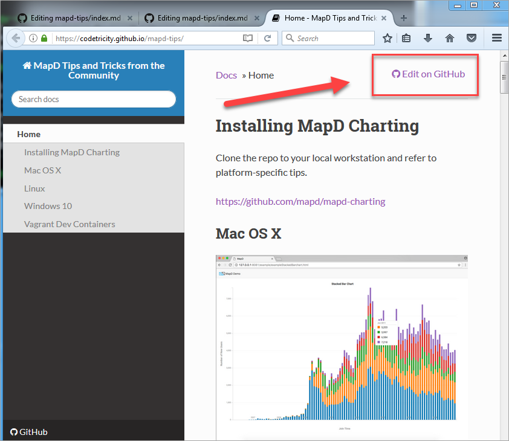
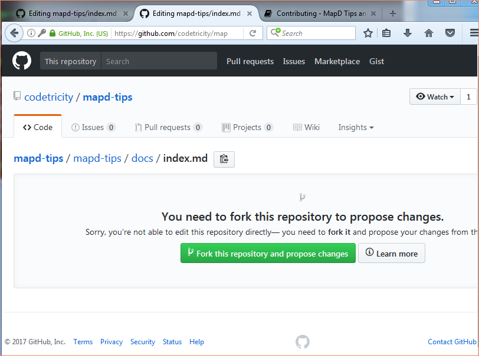
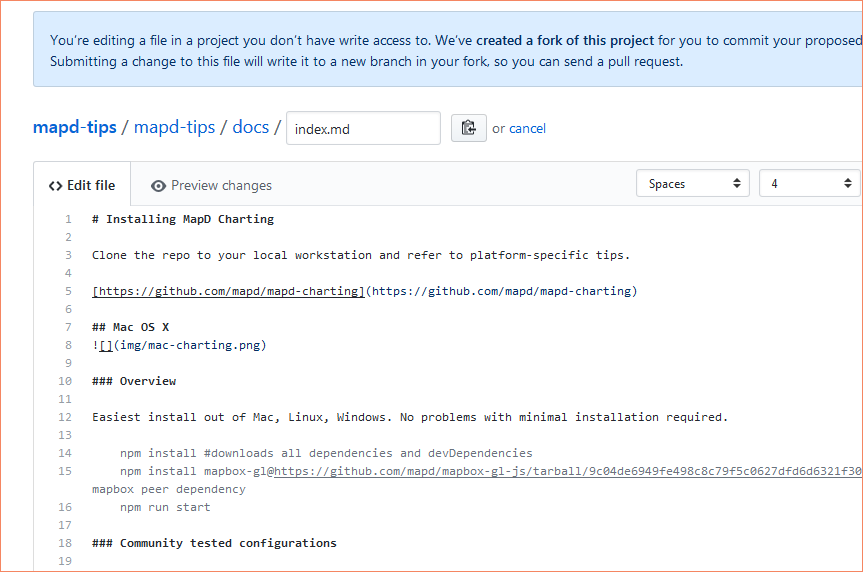
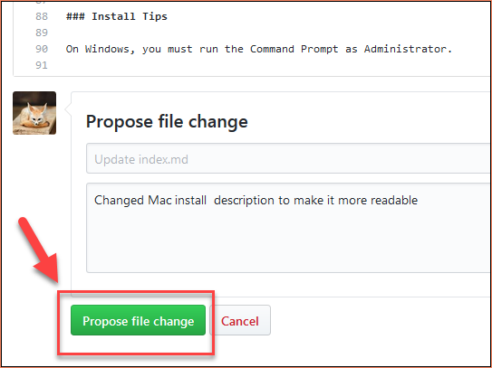
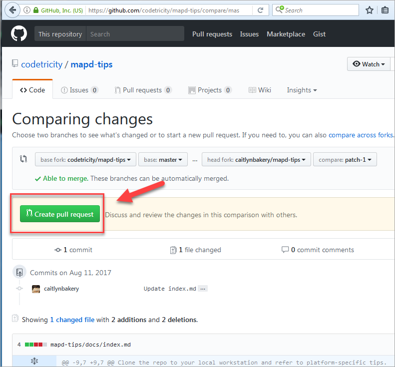
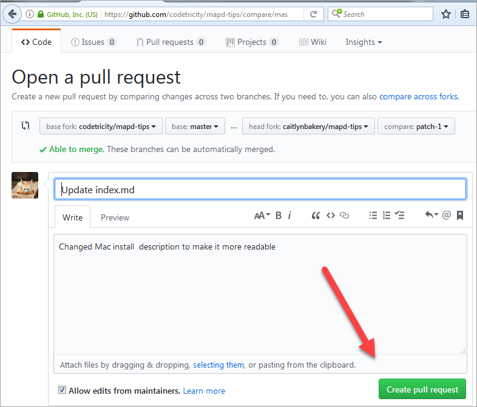
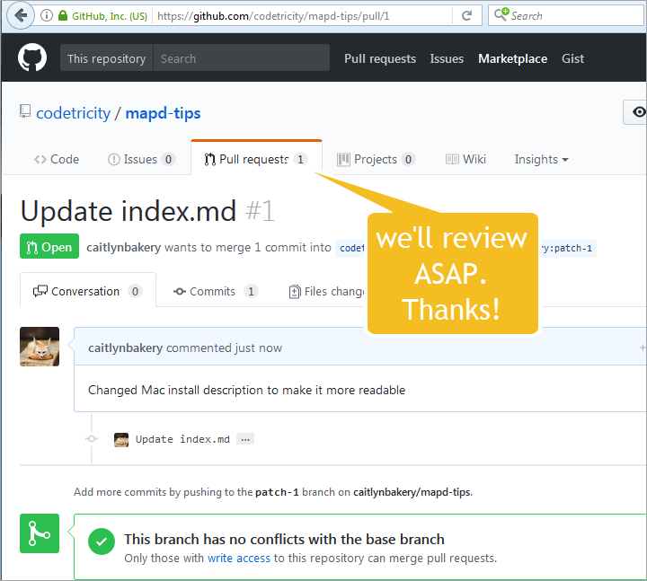

# Contributing to MapD Community Tips
Please add or edit this document. Do not be shy. We're just trying to create cool things with MapD and any contribution will help.

To edit this document, go to the *Edit on GitHub* button in the upper right.

The community docs are on GitHub. You will need to fork the repo and submit a pull request.

Edit the file in [Markdown](http://commonmark.org/help/).

Propose the change. Do not back down.
We will be happy to hear from you. If the change
is in error, either we'll help you to fix it or the 
community will help. Press the button. Do it.

Create the pull request.

Change to main document will be incorporated after a human being reviews it. Thanks.

