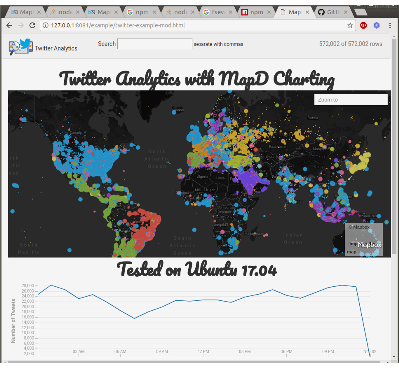
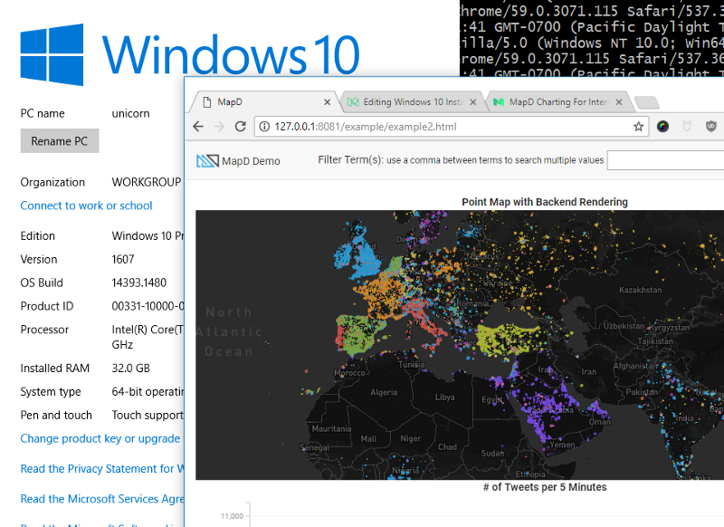

# MapD Tips from the Community

## Installing MapD Charting
### Mac OS X

#### Overview

Easiest install out of Mac, Linux, Windows. No problems with minimal installation required.

    npm install #downloads all dependencies and devDependencies
    npm install mapbox-gl@https://github.com/mapd/mapbox-gl-js/tarball/9c04de6949fe498c8c79f5c0627dfd6d6321f307 #downloads mapbox peer dependency
    npm run start

#### Community tested configurations

- node v6.11
- Mac OS X 10.12.5
- Xcode from Apple App Store

### Linux

#### Overview

Easy install if you use node 5.12.0. Set your node version with 
[nvm](https://github.com/creationix/nvm/blob/master/README.md) or 
[n](https://github.com/tj/n).

#### Community tested configurations

- node 5.12.0
- Ubuntu 17.04

### Windows 10

#### Overview
 You'll need to install some additional programs and libraries. Works great after you install these 
 components:

- bash to run script npm run start (which you probably have installed with git bash)
- Windows SDK 8.1 (you need this version, not Windows 10 SDK)
    - You may also need to install Visual Studio for the build tools
- Node 7.x or below (not node 8, which is the most recent version)
- Python 2.7x 64 bit 

In addition to the components above, you should also install the following manually
from the command line:

- install node-gyp globally (You'll see it in the warnings. `npm install -g node-gyp`)
- install node-sass manually (`npm install node-sass`)

#### Tips

As the PATH on git bash and the DOS command prompt are different. You may need to run 
some of the scripts from either DOS or Powershell. You need to run `npm run start` from bash.

#### Community Installation Notes

- [Windows 10 64 bit X99 architecture](https://medium.com/@wildcharting/mapd-charting-windows-10-install-adventures-and-tips-efc23359e20c)
- [Windows 10 64 bit workstation](https://medium.com/@wildcharting/mapd-charting-for-interactive-fun-412711a376f0)