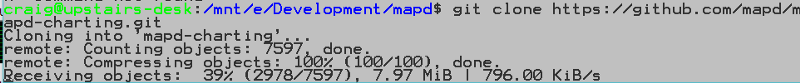

# Installing MapD Charting

Clone the repo to your local workstation and refer to platform-specific tips.

[https://github.com/mapd/mapd-charting](https://github.com/mapd/mapd-charting)

## Mac OS X

### Overview

Easy install. No problems. Very few external dependencies.

    npm install #downloads all dependencies and devDependencies
    npm install mapbox-gl@https://github.com/mapd/mapbox-gl-js/tarball/9c04de6949fe498c8c79f5c0627dfd6d6321f307 #downloads mapbox peer dependency
    npm run start

### Community tested configurations

- node v6.11
- Mac OS X 10.12.5
- Xcode from Apple App Store

## Linux

### Overview

Easy install if you use node 5.12.0. Set your node version with 
[nvm](https://github.com/creationix/nvm/blob/master/README.md) or 
[n](https://github.com/tj/n).

### Community tested configurations

- node 5.12.0
- Ubuntu 17.04

## Windows 10

### Overview
 You'll need to install some additional programs and libraries. Works great after you install these 
 components:

- bash to run script npm run start (which you probably have installed with git bash)
- Windows SDK 8.1 (you need this version, not Windows 10 SDK)
    - You may also need to install Visual Studio for the build tools
- Node 7.x or below (not node 8, which is the most recent version)
- Python 2.7x 64 bit 

In addition to the components above, you should also install the following manually
from the command line:

- install node-gyp globally (You'll see it in the warnings. `npm install -g node-gyp`)
- install node-sass manually (`npm install node-sass`)

### Tips

As the PATH on git bash and the DOS command prompt are different. You may need to run 
some of the scripts from either DOS or Powershell. You need to run `npm run start` from bash.

### Community Installation Notes

- [Windows 10 64 bit X99 architecture](https://medium.com/@wildcharting/mapd-charting-windows-10-install-adventures-and-tips-efc23359e20c)
- [Windows 10 64 bit workstation](https://medium.com/@wildcharting/mapd-charting-for-interactive-fun-412711a376f0)

## Vagrant Dev Containers

Vagrant is popular with developers and people involved in DevOps. It
allows you to install MapD Charting inside a Linux VM and use development
tools on your workstation. For example, you can install MapD Charting on Windows 
inside of a Linux VM and then use Visual Studio on Windows to develop a MapD 
Charting application. 

### Install Steps

1. Install [VirtualBox](https://www.virtualbox.org/wiki/Downloads)
2. Install [Vagrant](https://www.vagrantup.com/downloads.html)
3. Copy [Vagrantfile](https://gist.github.com/codetricity/c5ec02d5d4da605dab23be89d7abc800) into your development folder
4. Provision MapD Charting VM with `vagrant up`
5. ssh into VM with `vagrant ssh`
6. cd in `/vagrant/mapd-charting/` and run `npm run start`

### Install Tips

On Windows, you must run the Command Prompt as Administrator.

After you ssh into the VM, your files will be in `/vagrant/mapd-charting`.

The install with `vagrant up` takes 10-20 minutes. The installation script will appear to
have no movement during several sections.

Cloning the mapd-charting repository took 4 minutes. There's no status report from the
script during this stage. It will look like the screen below for 4 minutes.

There will be many messages that say, *WARN*. You can fix these laters when you're 
developing your application. The warning messages did not appear to impact the demos. The script stayed on the screen below for several minutes before moving on. There is no status update 
during that time.

### Accessing Linux Files from Windows

Files placed in `/vagrant/` inside the Linux VM will be visible from
inside the Windows directory you started Vagrant from.

You can now open your MapD Project folder in an IDE such as 
Visual Studio 2017.

### Browser Access to MapD Visualization Projects

Use the browser on your workstation. For example, point Microsoft Edge 
on Windows to `http://127.0.0.1/example/`.

In this workflow, you are using your Windows IDE and your Windows browser to
edit and view the MapD Charting application running on Linux.

Once the application is ready for public testing, move it to something
like AWS running Linux.

For more information on Vagrant configuration and workflows, refer to
the [Vagrant documentaion](https://www.vagrantup.com/docs/index.html).

## Windows Subsystem for Linux

Microsoft designed their Windows Subsystem for Linux for with web developers working on server side applications. This method avoids the 
performance hit of a VM and allows you to install MapD Charting using  Ubuntu 16.04 applications that talk to the Windows kernel.

### Prerequisites

- Windows 10 64 bit
- Developer Mode enabled
- Windows Subsystem for Linux — [Install guide from Microsoft](https://msdn.microsoft.com/en-us/commandline/wsl/install_guide)

At the Command Prompt, type *bash*.

> Note: if you don’t see a bash shell, go back and read the WSL install guide from Microsoft. There are also some tips at the end of this article.

cd into a development folder you can access from Windows.

clone mapd-charting repo into your development folder with

    git clone https://github.com/mapd/mapd-charting.git

Install npm with 

    sudo apt-get install npm

install `n` using npm.

Although your experience may be different, I had some problems with 
permissions when I tried to use `n` to install node 5.12. To solve this,
 I used bash as root temporarily to install a specific version of node with n.
When I do the install, I’m going to include `n` in the `PATH`.

> NOTE: /mnt/e/Development/ is the directory of my Windows E: drive that I do development in. /node_modules is the folder that npm installed n into. 

Install node 5.12 with this command:

    n 5.12

Exit bash running as root.

`cd` into `mapd-charting` and install it with npm.

    npm install

There will be a few warnings. This is fine. After the install finishes, install the peer dependency in 
`mapbox-gl-js`.

    npm install mapbox-gl@https://github.com/mapd/mapbox-gl-js/tarball/9c04de6949fe498c8c79f5c0627dfd6d6321f307

Start the MapD Charting demos with:

    npm run start

You can now access the demos from your web browser:

http://127.0.0.1:8081/example/

Open up an editor like VS Code, Atom, or Sublime and start editing the demos to get more 
familiar with the [MapD Charting API](https://mapd.github.io/mapd-charting/docs/).

### Additional Install Information
I’m installing Windows Subsystem for Linux from Powershell, not from the Microsoft store.

Set your computer to *Developer Mode*.

    Enable-WindowsOptionalFeature -Online -FeatureName Microsoft-Windows-Subsystem-Linux

Run bash at the command prompt. It will install Windows Subsystem for Linux.

